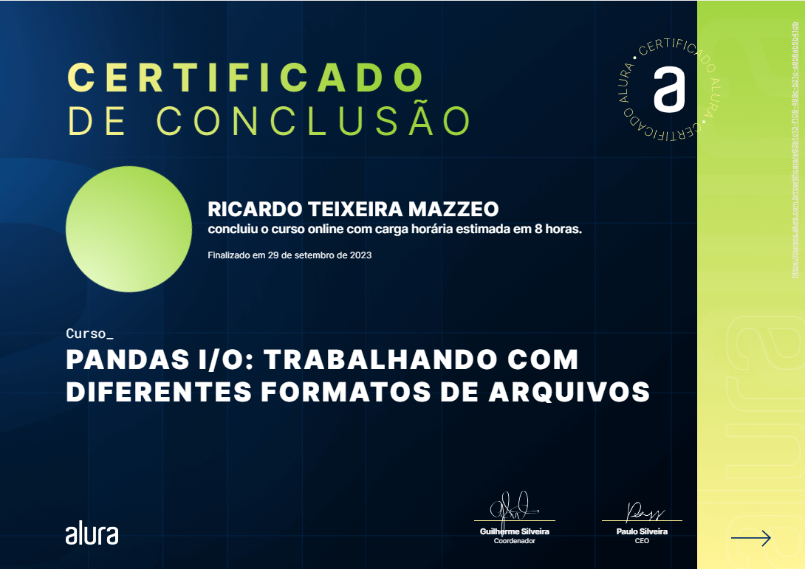

# Cursos Pandas

## Aula 1 - Pandas Conhecendo a biblioteca

**Conteúdo:**

- Importação de dados através de arquivo CSV
- Análise Exploratória (ex: média)
- Tratamento de valores nulos e remoção de valores inconsistentes e aplicação de filtros
- Criação de colunas (numéricas e categóricas)

## Aula 2 -  Pandas I/O: trabalhando com diferentes formatos de arquivos

- Manipulação de arquivos CVS;
- Utilização de Planilhas (Excel e google sheets)
- Manipulação arquivos JSON (com normalização)
- Leitura de dados HTML e XML
- Manipulação de bancos de dados

