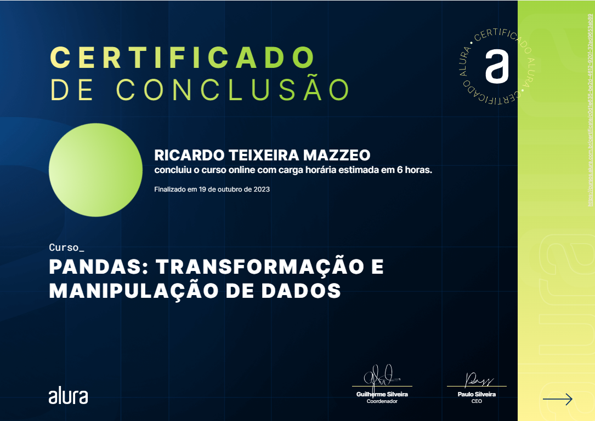

# Cursos Pandas

## Aula 1 - Pandas Conhecendo a biblioteca

**Conteúdo:**

- Importação de dados através de arquivo CSV
- Análise Exploratória (ex: média)
- Tratamento de valores nulos e remoção de valores inconsistentes e aplicação de filtros
- Criação de colunas (numéricas e categóricas)

## Aula 2 -  Pandas I/O: trabalhando com diferentes formatos de arquivos

**Conteúdo:**

- Manipulação de arquivos CVS;
- Utilização de Planilhas (Excel e google sheets)
- Manipulação arquivos JSON (com normalização)
- Leitura de dados HTML e XML
- Manipulação de bancos de dados

## Aula 3 -  Pandas: Selecionando e Agrupando Dados

**Conteúdo:**

- Modificar o formato de um DataFrame (melt)
- Construir tabela de dados agrupados (groupby)
- Transformar dados de uma para várias colunas (pivot_table)
- União de DataFrames (merge)
- Criação de graficos com o metodo plot e a biblioteca Plotly

## Aula 4 - Pandas: transformação e manipulação de dados

**Conteúdo:**

- Ler arquivos de dados no formato json
- Normalizar a visualização dos dados (json_nomalize)
- Identificar e transformar elementos dentro de listas em uma nova linha do DataFrame com explode;
- Transformar dados textuais em numéricos com o método astype;
- Tratar textos com dados numéricos para serem transformados com apply (1 coluna) e applymap (varias colunas)
- Manipular elementos textuais em um DataFrame, utilizando expressões regulares (regex) para tratar o texto;
- Transformar textos em listas;
- Realizar o processo de tokenização de strings;
- Identificar, transformar e manipular dados de tipo datetime.

